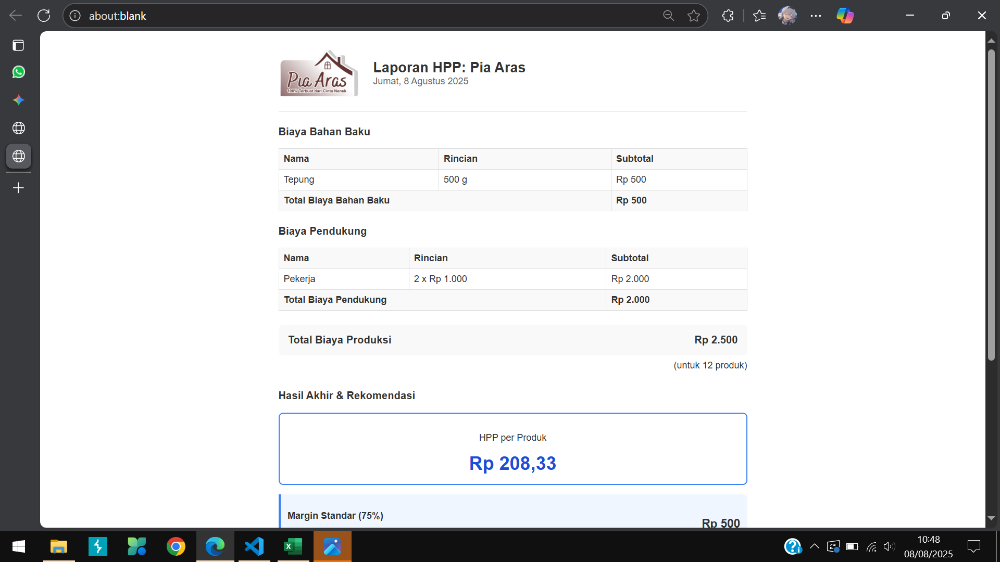

# HPPinAja 🚀

## Kalkulasi HPP UMKM dalam sekejap

**HPPinAja** adalah aplikasi web sederhana yang dirancang khusus untuk membantu para pelaku UMKM, khususnya di bidang kuliner atau kerajinan, dalam menghitung Harga Pokok Penjualan (HPP) produk mereka dengan mudah, cepat, dan akurat.

 

---

### ✨ Fitur Utama

* **Antarmuka Mobile-First:** Didesain agar nyaman dan mudah digunakan di layar HP.
* **Perhitungan Detail:** Memisahkan biaya bahan baku dan biaya pendukung dengan rinci.
* **Konversi Satuan Otomatis:** Menghitung biaya secara akurat meskipun satuan beli (kg) dan satuan pakai (gram) berbeda.
* **Tombol Hitung per Baris:** Alur kerja yang jelas, hitung subtotal per baris dan kunci data untuk menghindari kesalahan.
* **Laporan Profesional:** Menghasilkan laporan HPP di halaman baru yang siap cetak, lengkap dengan nama produk dan logo usaha Anda.
* **Rekomendasi Harga Jual:** Memberikan 3 tingkat rekomendasi harga jual (Standar, Ideal, Premium) untuk membantu strategi penjualan.
* **Bisa Di-install (PWA):** Aplikasi bisa di-install di layar utama HP dan dapat diakses bahkan saat offline.

### 📖 Cara Menggunakan

1.  **Isi Informasi Produk:** Masukkan Nama Produk yang akan dihitung dan unggah Logo Usaha Anda (opsional) agar tampil di laporan.
2.  **Isi Biaya Bahan Baku:**
    * Klik tombol **"+ Tambah Baris Bahan Baku"** untuk setiap bahan.
    * Isi semua kolom: nama bahan, jumlah pemakaian, harga beli, dan jumlah beli beserta satuannya.
    * Jika satu baris sudah benar, klik tombol **"✅ Kunci"** di baris tersebut. Angka subtotal akan muncul dan baris akan terkunci.
3.  **Isi Biaya Pendukung:** Lakukan hal yang sama untuk biaya operasional seperti upah, gas, kemasan, dll. Klik **"✅ Kunci"** di setiap baris.
4.  **Isi Jumlah Produk Jadi:** Masukkan berapa banyak produk yang dihasilkan dari total biaya di atas.
5.  **Buat Laporan:** Klik tombol utama **"Buat Laporan HPP"**.
6.  **Cetak atau Simpan:** Sebuah tab baru akan terbuka berisi laporan lengkap. Klik tombol **"🖨️ Cetak Laporan"** untuk menyimpan sebagai PDF atau mencetaknya.

### 📲 Cara Install di HP

Aplikasi ini adalah Progressive Web App (PWA), artinya bisa di-install seperti aplikasi biasa.

1.  Buka link aplikasi ini di browser HP Anda (Google Chrome atau Safari).
2.  Klik menu browser (biasanya ikon titik tiga atau ikon share).
3.  Cari dan pilih opsi **"Install app"** atau **"Add to Home Screen"** (Tambahkan ke Layar Utama).
4.  Ikon **HPPinAja** akan muncul di layar utama HP Anda, siap digunakan kapan saja!

---
Semoga bermanfaat!
